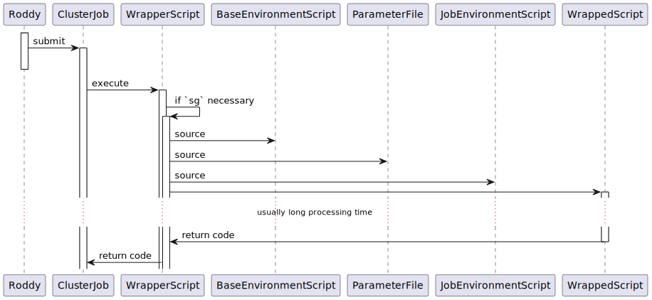

# Default Roddy Plugin

The root of all Roddy plugins, including the PluginBase plugin.

The overall structure of Roddy and its plugins can be depicted like this:


The [PluginBase](https://github.com/TheRoddyWMS/Roddy-Base-Plugin) provides a base class `BasePlugin` for the JVM-compiled code of all plugins.
Roddy uses this JVM-compiled code to manage cluster jobs and do submission-time checks of input files (usually by accessing the files from the cluster's head-node).

By contrast, the DefaultPlugin provides a wrapper script `wrapInScript.sh` which is used to wrap the top-level, bioinformatic (or "wrapped") scripts that are developed by workflow developers for each (cluster) job. 
Roddy basically composes a command call for the `wrapInScript.sh`, which then sets up the environment for the wrapped script, calls the wrapped script, and eventually does some cleanup work.


> This software is for research-use only (RUO).

## Dependencies

You need at least Bash 4.2 for running the `wrapInScript.sh`.

## General Structure

The wrapper script is called by the cluster job that was submitted by Roddy in a fire-and-forget fashion:



The wrapper script does the following steps


## Calling Conventions of the `wrapInScript.sh`

The `wrapInScript.sh` is called without any parameters. 
The entire configuration of the `wrapInScript.sh` and the wrapped top-level bioinformatic script is done via environment variables and a configuration file.

* `PARAMETER_FILE` is the path to the parameter file that is loaded (and thus evaluated) by the Bash `source` command.
The parameter file should `export` all variables and `export -f` all functions that are needed by the wrapped script.
* `debugWrapInScript` is a string variable that turns on debugging options in the `wrapInScript.sh`.
* `outputFileGroup`: Can be set to the name of an existing UNIX group of which the user is a member. This group will be used for the output files of the wrapped script.
* `sgWasCalled`: Should be set to "false" to prevent `sg` from being called to change the primary group (the group used for creating files) before the wrapped script is called.

## Files created

* job-state logfile: The file logging the starts and ends of the wrapper script executions.
* job-state logfile lock-file: This has the same name and location as the job-state logfile, but with the suffix `~` appended.
The log-file is accessed twice, once before the wrapped script execution, and once after the wrapped script execution, in order to add two logging lines to the file.
The lock-file is used each time to prevent concurrent modification of the log-file.
* `$executionLogDir/extendedLogs` directory: This directory contains the extended logs of the wrapped script and creates a file for each cluster job (using the job's parameter file name as template). 
Each file will be called like the `.parameter` file of the job, but without the `.parameter` suffix.
It contains two dumps of the environment during the execution of the wrapped script -- before and after the parameter file was `source`d.

## Environment Setup Support

### Base Environment Script

Each job is started with the default environment configured _via_ the `baseEnvironmentScript` variable in your `applicationProperties.ini`.
The `baseEnvironmentScript` serves as general configuration of your cluster environment. 
Usually, you will use a script like `/etc/profile` or `$HOME/.profile` or `$HOME/.bashrc`. 

Note that often the `baseEnvironmentScript` is not under your control and may be sensitive for certain environment options, such as `set -e` or `set -u`.
Therefore, error checks and logging options, which are turned on in the `wrapInScript.sh` if you set `debugWrapInScript=true`, will be turned off while reading the base environment.
If you write your own base-environment script, you should activate these options in your code, to ensure errors are caught during script execution.

### Workflow- and Job-Environment Scripts

After the base environment script and the job-parameter files were sourced, the wrapper script checks whether you have a dedicated environment script defined for the whole workflow or this specific cluster job.
These environment scripts are defined in one of the configuration XMLs or on the commandline via the `--cvalues` parameter.

The "workflow-environment" script defines the environment for all jobs of the workflow. 
By contrast, "job-environment" scripts define the environment for individual jobs and take precedence over the workflow-environments.
Thus, if a job-environment script is defined for a job, then the global workflow-environment script is not sourced for this job.

To define a workflow-level environment setup script, you can add lines like the following to your XMLs:

```xml
<configurationvalues>
  <cvalue name="workflowEnvironmentScript" value="workflowEnvironment_conda" type="string"
          description="Use 'workflowEnvironment_conda' for a generic Conda environment."/>
</configurationvalues>
<processingTools>
   <tool name="workflowEnvironment_conda" value="conda.sh" basepath="environments"/>
   <tool name="workflowEnvironment_lsf" value="lsf.sh" basepath="environments"/>
</processingTools>
```

This will declare two environment scripts and select the "workflowEnvironment_conda" as the environment to use. 
If appropriate, the user running the workflow can still override this setting and select `lsf.sh` as job environment by defining, e.g. `--cvalue="workflowEnvironmentScript:workflowEnvironment_lsf"` on the command line. 
In this example, environment scripts need to be located in the `resources/environments` directory in the plugin, which is copied to the execution host.

You may want to specify dedicated job-environment scripts for individual cluster jobs. 
These take precedence over the global workflow environment script.
For instance, the following defines a tool as environment script for the `correctGcBias` cluster job (which is also defined as tool).

```xml
<configurationvalues>
    <cvalue name="correctGcBiasEnvironmentScript" value="${TOOL_CORRECT_GC_BIAS_ENVIRONMENT_CONDA}" type="string"/>
</configurationvalues>
<processingTools>
  <tool name="correctGcBiasEnvironment_conda" value="conda-correctGcBias.sh" basepath="environments"/>
</processingTools>
``` 

Internally, the tool names are mapped to a `TOOL_` bash variable using to the following algorithm:
  - inserting an underscore '\_' before all capitals, 
  - changing all letters to upper-case, and 
  - prepending "TOOL\_" before the name.
  
It is also possible, to refer to the tool by using a configuration value of the form `${TOOL_WORKFLOW_ENVIRONMENT_CONDA}`. 
This form is occasionally used in existing plugins, but we advise you to use the first simpler form.

Sometimes having to modify the plugin in place is not possible or desirable, e.g. during debugging. 
In this case, you can also specify the environment script directly in the configuration value like in "/path/to/develEnv.sh". 
This path should be absolute and must be available on the execution host. 
This possibility is only available since version 1.2.2-5 of this plugin.
 
The logic to discriminate between these three cases is as follows:
  - the value contains a '/': this is a direct path. This only works since version 1.2.2-5.
  - the value starts with '${': this is a TOOL_ path. Since version 1.2.2-5 the matching is on `${TOOL_}`.
  - compose the `TOOL_` variable name from the job-name, like described above.

### Environment Parametrization

The environment script is `source`'d after the `PARAMATER_FILE`, so you can access variables from the parameter-file.
For instance, you have an environment script `conda.sh` that activates a Conda environment, but you want to keep the environment name configurable. 
You can then set the conda environment name in the XML via some configuration value, e.g.:

```xml
<cvalue name="condaEnvironmentName" value="myWorkflow" type="string"
        description="Name of the Conda environment on the execution hosts. Used by the environment setup script conda.sh defined as tool below."/>
```

Then your `conda.sh` may look like this:

```bash
source activate "$condaEnvironmentName"
```

### Exporting Variables from the Environment Script

The environment setup scripts are mostly useful for setting up environment variables that can be used in the wrapped script, which does the actual job for you.

To achieve this, Bash variables need to be exported with the `export` declaration. 

Sometimes it can be useful to define a Bash function in the environment script, for use in the wrapper.
These Bash functions can get exported with `export -f`.
An example is a wrapper function for a tool with a complex call which you want to wrap for better readability in your workflow code.

Note that due to a bug in Bash with exported array variables in Bash <4.4, something like `export -a` won't work. 
We suggest here to take the same strategy as the `PARAMETER_FILE` does, namely to export them as quoted Bash array string

```bash
export arrayStringVar="(a b c d)"
```

and then cast this string into a Bash arrays in your wrapped script with

```bash
declare -a arrayVar="$arrayStringVar"
```

### Debugging and Error Behaviour
  
The `debugWrapInScript` variable -- defaulting to `false` -- turns on the `set +xv` verbosity shell options.
  
The `baseEnvironmentScript` is sourced with relaxed values for `set`, i.e. with `set +ue`, because often files like `/etc/profile` are not under the control of the person running the workflow. Conversely, changes to the `set` options in the `baseEnvironmentScript` are not inherited by subsequent code in the `wrapInScript.sh`.

The environment script has the same values for the shell options set via `set` in Bash, as the wrapper.
In particular this means that `errexit` is set.
Changes in the environment script *are* inherited by subsequent code in the `wrapInScript.sh`.

It is possible to run the same command that Roddy runs as remote job from the interactive command line.
The wrapper script recognizes that it is run in an interactive session and avoids an exiting of the Bash upon errors (i.e. `set +e` is set) but should otherwise behave exactly as if run by `bsub` or `qsub`.

Finally, the wrapped script has debugging options `WRAPPED_SCRIPT_DEBUG_OPTIONS`.
For convenience, the application of these options can be turned off by the `disableDebugOptionsForToolscript`.

### Wrapped-Script Execution

As stated previously, the wrapped script is executed by Bash. 
This means you can use a shebang-line to select an arbitrary interpreter, e.g. one you have pulled into the environment via the `baseEnvironmentScript` or the workflow- or job-specific environments scripts.
  
### Conventions

The following conventions are nothing more than that and are currently not enforced by Roddy:

* use camel-case tool names starting with small letters (e.g. "correctGcBias")
* append the arbitrary environment name that you want to use to the tool name to get the name of the environment variable
* describe the environment in the `description` attribute of the `cvalue` tag
* the environment setup scripts is located in the "environments" subdirectory of the workflow directory in the plugin

## Changelog

* 1.2.2-5

  - Turn off debugging options when sourcing environment files. This allows using environment scripts that fail because of `set -u`).
  - Refactored lockfile code in `wrapInScript.sh`.
  - Report if user is not member of `outputFileGroup`.
  - Allow defining environment scripts outside the plugin `resources/` directory.

* 1.2.2-4

  - `buildversion.txt` did not correctly reflect the version 1.2.2
  - allow for /ad hoc/ custom environment scripts 

* 1.2.2-3

  - get Bash via `/usr/bin/env`
  - using a bash 4 feature to do the childprocess listing
  - child-process killing 

* 1.2.2-2

  - removed unused `preventJobExecution` variable
  - extended checks for `RODDY_SCRATCH`
  - add `killBackgroundJobs` to deal with processes not killed by batch-processing system
  - set generic temporary variables (`TMP`, `TMPDIR`, `TEMP`) to scratch
  - set {input,output}AnalysisBaseDirectory defaults


* 1.2.2-1

  - updated dependency to Roddy 3.0 (note Roddy "2.4" is a development-only version)

* 1.2.2

  - added shunit2 tests
  - Remove autocheckpoint code
  - Improve debugging
  - `disableDebugOptionsForToolscript` to turn off wrapped script debugging
  - fixed typo that caused `2`-directory to be created in user's home
  - source `baseEnvironmentScript`
  - remove `CONFIG_FILE` references (i.e. `runtimeConfig.sh`) 
  - deal with environments that don't have LD_LIBRARY_PATH undefined when set -u is configured
  
* 1.2.1

  - check LD_LIBRARY_PATH definition before exporting, otherwise error with set -u

* 1.2.0

  - `defaultScratchDir` removed
  - error redirection into stderr
  - fixed errors if `debugOptionsUseUndefinedVariableBreak` is set
  - write environment into extended logs
  - 
  
* 1.0.34

  - require Roddy 2.4 (=3.0) and PluginBase 1.0.29
  - "native" workflow support
  - removed some older scripts not used anymore (fileStreamBuffer.sh, findOpenPort.sh, jobEpilogue.sh, jobPostEpilogue.sh, streamBuffer.sh)
  - module support directly in wrapInScript.sh
  - check parameter and configuration file usability
  
* 1.0.33

  - first Github version of the plugin
  - Roddy 2.3
